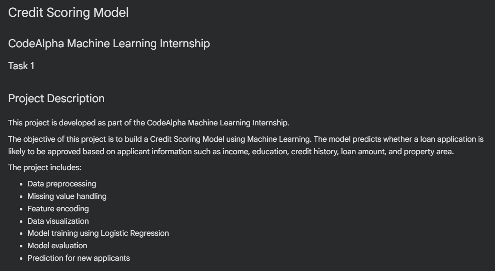
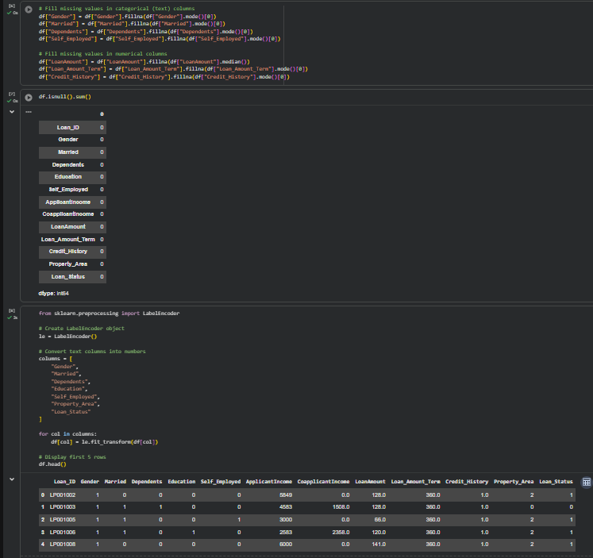
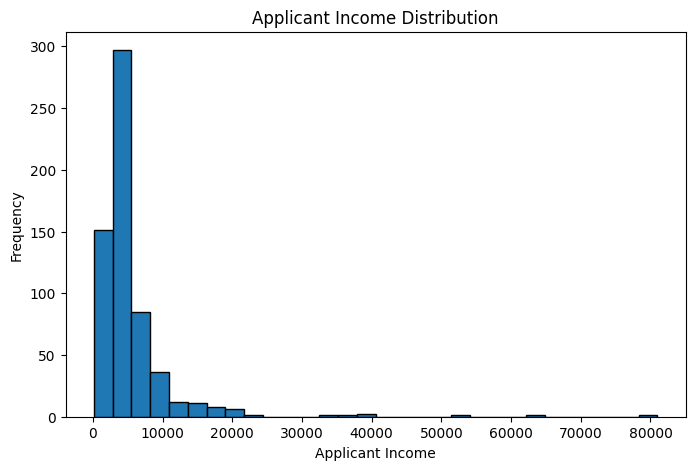
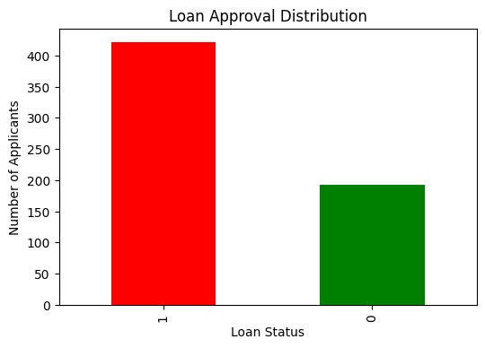
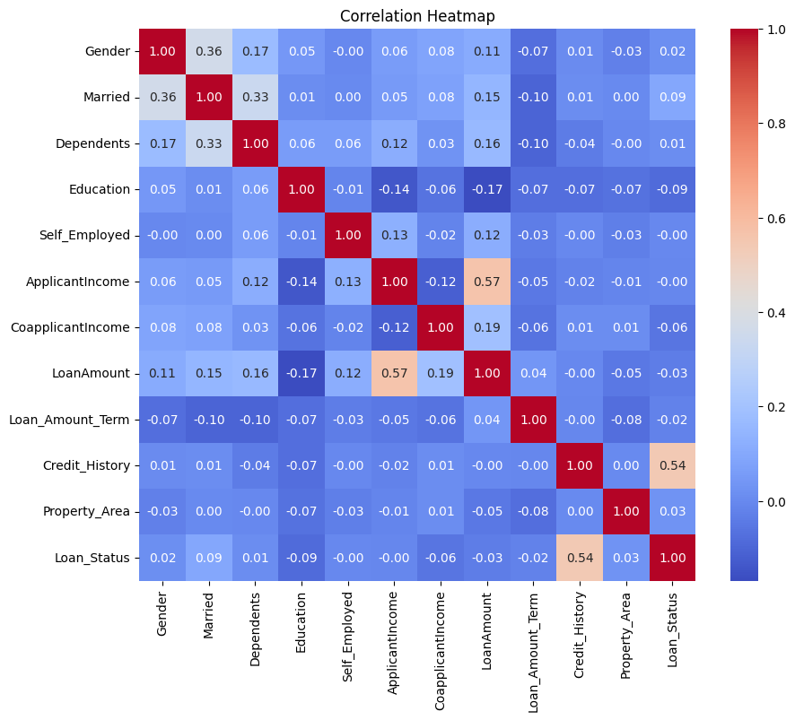
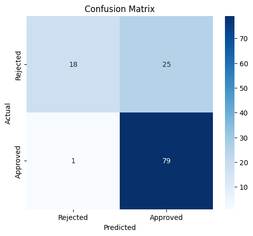
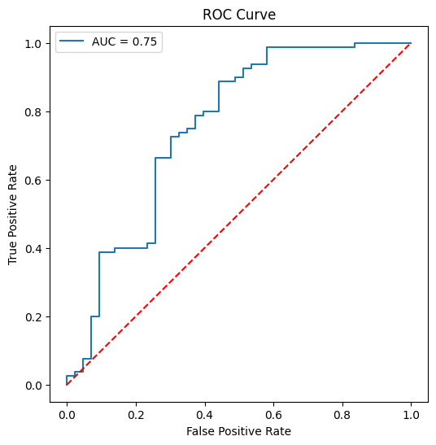
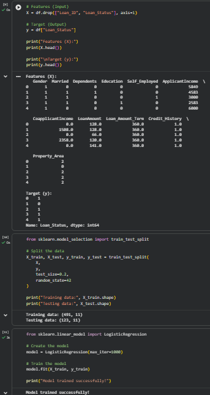
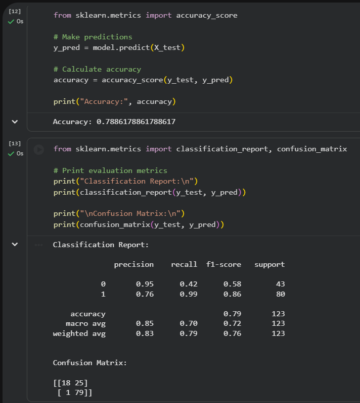
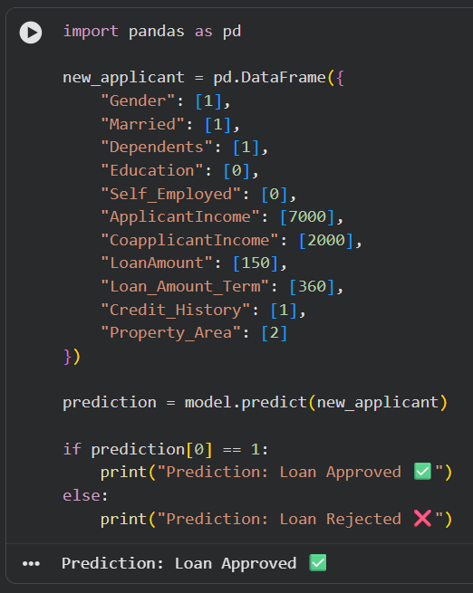

# Credit Scoring Model

## CodeAlpha Machine Learning Internship - Task 1

## Project Overview

This project was developed as part of the CodeAlpha Machine Learning Internship.

The objective of this project is to build a Credit Scoring Model that predicts whether a loan application is likely to be approved based on applicant information using Machine Learning.

---

## Dataset

The dataset contains information about loan applicants, including:

- Gender
- Marital Status
- Dependents
- Education
- Self Employment
- Applicant Income
- Coapplicant Income
- Loan Amount
- Loan Amount Term
- Credit History
- Property Area
- Loan Status

---

## Technologies Used

- Python
- Pandas
- NumPy
- Matplotlib
- Seaborn
- Scikit-learn
- Joblib
- Google Colab

---

## Machine Learning Workflow

- Data Loading
- Data Cleaning
- Missing Value Handling
- Feature Encoding
- Data Visualization
- Train-Test Split
- Logistic Regression Model
- Model Evaluation
- Prediction
- Model Saving

---

## Model Performance

- **Accuracy:** 78.86%

### Evaluation Metrics

- Precision
- Recall
- F1-Score
- ROC-AUC Score
- Confusion Matrix

---

## Project Files

- Credit_Scoring_Model.ipynb
- credit_scoring_model.pkl
- train_u6lujuX_CVtuZ9i.csv
- README.md

---

## Project Screenshots

### Project Overview

### Data Preprocessing

### Applicant Income Distribution

### Loan Approval Distribution

### Correlation Heatmap

### Confusion Matrix

### ROC Curve

### Model Training

### Model Evaluation

### Prediction on New Application

---

## Author

**Sanjay**

CodeAlpha Machine Learning Internship
CodeAlpha Machine Learning Internship
