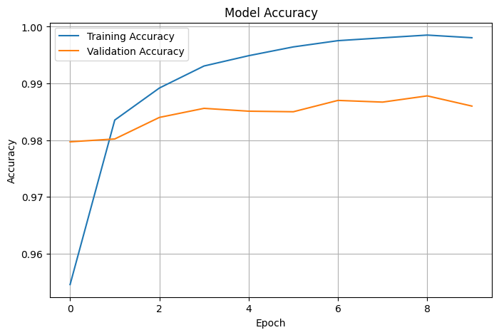
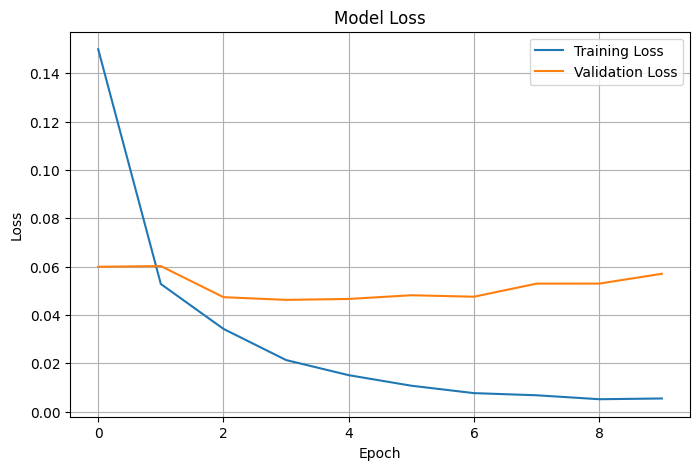

# ✍️ Handwritten Character Recognition

## 📌 Overview
This project uses a Convolutional Neural Network (CNN) to recognize handwritten digits from the MNIST dataset.

## 🛠️ Technologies Used
- Python
- TensorFlow
- NumPy
- Matplotlib
- Google Colab

## 📊 Results

### Model Accuracy

### Model Loss

### Model Summary

### Training Output

### Prediction

